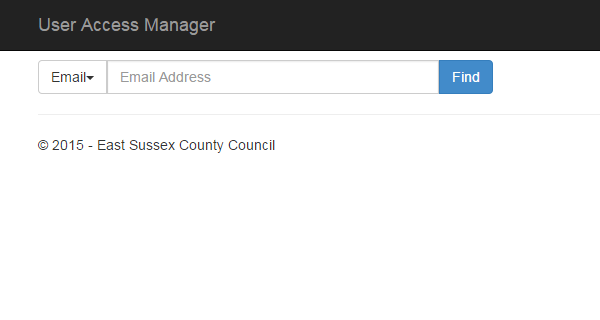
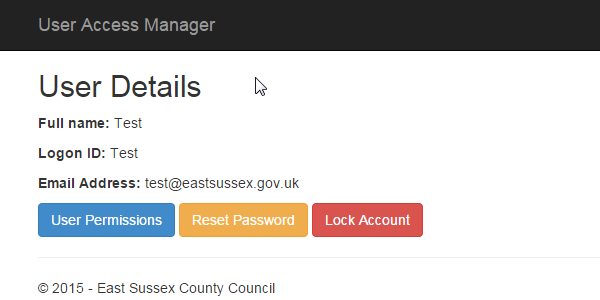
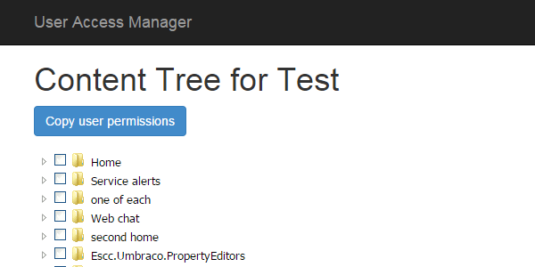
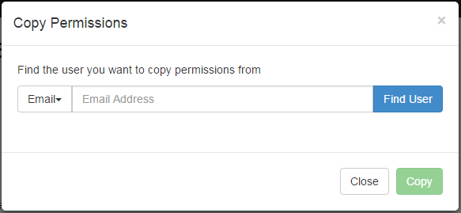
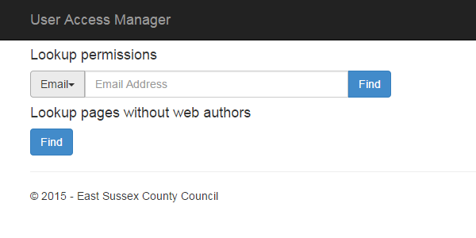

# User Access Manager

## Introduction

Search for user either by email or user name.

If the user exists, their details will be displayed along with the following options:

*	Reset password
*	Lock (unlock) account
*	User permissions

This application will only allow changes to be made to Web Authors.

## User permissions

Displays the current content tree, showing the permissions assigned to the selected user.

Each level of content tree is retrieved when its parent is expanded, hence the icon may change from a document to a folder if there are sub-nodes.

Ticking and clearing the checkbox against each page updates the permissions immediately.

## Copy user permissions

Replace permissions for the current user with those from another user.

 

## Reset password
Sends an email to the user, containing a link to a page where they can change their password. The link is valid for 24 hours.

Clicking the button will send the email immediately.

## Lock (unlock) account

Immediately lock or enable the user account.
 
## Tools

There is a tools folder (/tools/) with the following pages / options:

 
### Lookup permissions

Check which pages a user has access to, using either email address or username. Alternatively, you can check which users have permissions for a specific page.

### Lookup pages without web authors

Search the entire site and list pages that do not have any web authors assigned.

## Permissions

**WebServices**: Has full permission to the entire application.

**ServiceDesk**: Has permission to lookup a user and initiate a password reset.
